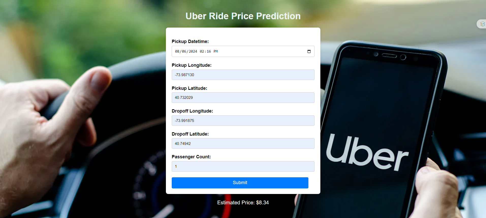

# Uber Ride Price Prediction

A web application that predicts the price of an Uber ride based on several factors, such as pickup location, dropoff location, and the number of passengers.

## Setup and Installation

1. Clone the repository to your local machine.
2. Install the required Python packages by running `pip install -r requirements.txt`.
3. Start the FastAPI server by running `uvicorn app:app --host 0.0.0.0 --port 9696`.

## Usage

1. Open your web browser and navigate to `http://localhost:9696`.
2. Fill out the form with the details of your ride.
3. Click the "Submit" button to get a prediction of the ride price.

## Technologies Used

- FastAPI for the web server.
- jQuery for handling AJAX requests.
- Python for the prediction logic.

## Future Improvements

- Improve the accuracy of the prediction model.
- Add support for more ride types.
- Improve the user interface.

## Contributing

Pull requests are welcome. For major changes, please open an issue first to discuss what you would like to change.

## License

[MIT](https://choosealicense.com/licenses/mit/)
